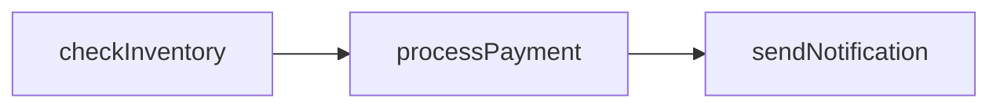

# temporal-multi-systems-example


This project demonstrates the use of Temporal for orchestrating workflows and activities in TypeScript. It simulates an order processing system that involves checking inventory, processing payments, and sending notifications. Temporal is a powerful platform designed to handle complex, reliable workflows across distributed systems, enabling developers to build resilient applications with ease.
## Install dependencies
```
npm install
```

in each sub repo

## Start Server
You can install the latest version with Homebrew using the following command:

```
brew install temporal
```

Once you've installed Temporal CLI and added it to your PATH, open a new Terminal window and run the following command:

```
temporal server start-dev
```

This command starts a local Temporal Service. It starts the Web UI, creates the default Namespace, and uses an in-memory database.

The Temporal Service will be available on localhost:7233.
The Temporal Web UI will be available at http://localhost:8233.


## Start Each Microservice
Run each service in their respective directories to ensure they are operational:

```
node inventory-service/index.js
node payment-service/index.js
node notification-service/index.js
```
## Build the Temporal service

```
cd temporal-service
npm run build
```

## Run Temporal Worker:
Start the Temporal worker to listen for workflow executions:

```
npm run start-worker
```

## Trigger Workflow Execution:
Execute the order processing workflow:

```
npm run start-client
```